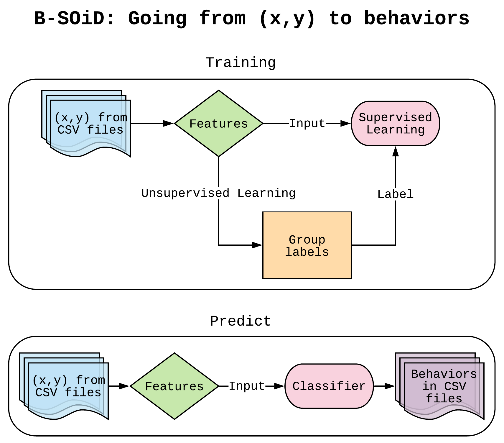
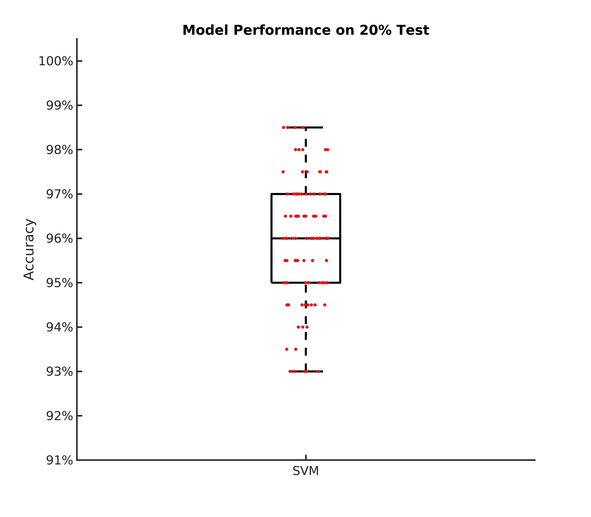

The dataset from *Yttri lab, Alexander Hsu,* has been tested against multiple human observers and showed comparable inter-grader variability as another observer. 


We also tested the generalizability with the dataset from *Ahmari lab , Jared Kopelman, Shirley Jiang, & Sean Piantadosi*, and was predictive of actual behavior.


## Why B-SOiD ("B-side")?
[DeepLabCut](https://github.com/AlexEMG/DeepLabCut)<sup>1,2,3</sup> has revolutionized the way behavioral scientists analyze data. The algorithm utilizes recent advances in computer vision and deep learning to automatically estimate 3D-poses. Interpreting the positions of an animal can be useful in studying behavior; however, it does not encompass the whole dynamic range of naturalistic behaviors. 

Behavioral segmentation of open field in DeepLabCut, or B-SOID ("B-side"), is an unsupervised learning algorithm in MATLAB/Python that serves to discover behaviors that are not pre-defined by users. Our algorithm can segregate statistically different sub-second rodent behaviors with a single bottom-up perspective video-camera. Upon DeepLabCut estimating the positions of 6 body parts (snout, the 4 paws, and the base of the tial) outlining a rodent navigating an open environment, this algorithm performs t-Distributed Stochastic Neighbor Embedding (t-SNE<sup>4</sup>, MATLAB&copy;) of the 7 different time-varying signals to fit Gaussian Mixture Models<sup>5</sup>. The output agnostically separates statistically significant distributions in the 3-dimensional action space and are found to be correlated with different observable rodent behaviors.

This usage of this algorithm has been outlined below, and is extremely flexible in adapting to what the user wants. With the ever-blooming advances in ways to study an animal behavior, our algorithm builds on and integrates what has already been robustly tested to help advance scientific research.

## Installation

Git clone the web URL or download ZIP. 

Change your current working directory to the location where you want the cloned directory to be made.

```bash
git clone https://github.com/YttriLab/B-SOID.git
```

## Usage (MATLAB)
Change the MATLAB current folder to the folder containing `B-SOID/bsoid` 

### Step I, the only step you need!
Setting up parameters for the master script.
If you are interested in creating short videos (.avi) of the groups to help users subjectively define the various actions.
#### Install [FFmpeg](https://github.com/adaptlearning/adapt_authoring/wiki/Installing-FFmpeg) or other software that can achieve the same thing, I will provide the FFmpeg command lines below

Go to your video directory.
```C
cd your/video/directory/mouse.mp4
```

#### Use FFmpeg to create 10fps frames from your videos to match grp
```C
ffmpeg -i your_highspeedvideo.mp4 -filter:v fps=fps=10 your_10fpsvideo.mp4
mkdir your_10fpsPNG
ffmpeg -i "your_10fpsvideo.mp4" your_10fpsPNG/img%01d.png
```

Keep track of what video you have extracted frames from. I would use that as the first .csv to be selected once you run the master script `bsoid_master_v1p2.m`. To do so, set `s_no = 1` in line 32 of the master script. This is calling the first .csv input and map behavioral indices to frames you have extracted from the video.  

```matlab
%%% bsoid_master_v1p2 line 31-32
% Assuming you trained on multiple sessions, select the session number corresponding to your video/frames
s_no = 1;
```
In addition, let's set the number of .csv files you have to build a classifier on. For instance, if you have 3 .csv files generated from DeepLabCut, set `n = 3` in line 8 of the master script. This will compile the data into a cell of matrices. If, however, you have only 1 .csv file you want to test this program out, you will still need to run the for loop, set `n = 1` in line 8, for proper data format.

```matlab
%%% bsoid_master_v1p2 line 8
n = 3; % How many .csv files do you want to build your model on?
```

Lastly, before we run the master script, let's set the number of .csv files you want to predict behaviors based on pose using your own SVM model that you just trained. If you want to predict the same .csv files with the machine learning model, set `m = 3` or `m = 1` in line 36 of the master script.

```matlab
%%% bsoid_master_v1p2 line 35-36
%% Once you trained your action model
m = 3; % How many .csv do you want to test on?
```
Once this is all done, run the `bsoid_master_v1p2.m` script. 

Note that it will pop up user interfaces for you to select the files. Make sure you follow the printed statements for what to be selected.
`Please select 2 DeepLabCut generated .csv file for training data.` is asking you to select the second training .csv files.
`Please select the folder containing FFmpeg generated frames from your 10fps video.` is asking you to select the folder containing extracted frames.
`Please select output folder for GIF.` is asking you to select/create an output folder for snippets of extracted behaviors (.avi) 
`Please select 1 DeepLabCut generated .csv file for testing data.` is asking you to select the first testing .csv files.

Alternatively, you can learn more about the algorithm and only adopt one or few of the following steps. 

### Step I.1
Import your .csv file from DeepLabCut, and convert it to a matrix. We can run a for loop to get all of the .csv loaded into your matlab environment. After each individual raw .csv files are imported as a matrix, we evaluate the likelihoods of all points and apply a high-pass filter for estimated data likelihood `adp_filt`.
```matlab
n = 2; % How many .csv files do you want to build your model on?
for i = 1:n
    %% Import data
    fprintf(sprintf('%s%s%s','Please select ',num2str(i),' DeepLabCut generated .csv file for training data. \n'));  
    cd /your/dlc/output/folder/ % make sure you change this to the folder you have saved the .csv files for pose estimation
    [filecsv,pathcsv] = uigetfile('*.csv'); % shows you only .csv files
    filenamecsv = sprintf('%s%s',pathcsv,filecsv); 
    data_struct = importdata(filenamecsv); 
    rawdata{i} = data_struct.data; % import data as matrix in a cell
    %% Adaptive high-pass filter based on data for parts that are easily occluded
    [MsTrainingData{i},perc_rect] = adp_filt(rawdata{i});
end
```

Alternatively, load the Yttri lab's demo training dataset.
```matlab
load MsTrainingData.mat
```

### Step I.2
#### &nbsp;&nbsp;&nbsp;&nbsp; `Option 1`: Unsupervised grouping of the purely data-driven t-SNE space based on Gaussian Mixture Models (GMM). Refer to [bsoid_gmm.md](docs/bsoid_gmm.md). With version 1.2, try bsoid_assign.m for better separation of clusters, especially for larger datasets.

```matlab
%% Segment the groups based on natural statistics of input features, refer to our paper for feature list
[feats,tsne_feats,grp,llh,bsoid_fig] = bsoid_assign(MsTrainingData,60,1); % Change 60 to your frame rate. Set 1 for a compiled space for all .csv.
```

Alternatively, you can load the demo f_10fps and groupings.
```matlab
load MsTrainingFeats.mat MsActionGrps.mat
```
.

The 3-dimensional figure above shows the agnostic groupings of our demo training dataset undergoing unsupervised learning classification. 

### Step I.3 
#### Build a personalized multi-class Support Vector Machine (SVM) classifier based on feature distribution of the individual GMM groups. Refer to [bsoid_mdl.md](docs/bsoid_mdl.md). With version 1.2, bsoid_mdl2.m computes the size of each group to run cross-validation for a given iteration and train/test ratio. For example, if you desire a 80/20 = train/test, and that your dataset is 1000 behavioral data points, with 10 cross-validated iterations, the size of each test group will be 20 behavioral data points, `1000*0.2/10 = 20`. 
```matlab
%% Build a Support Vector Machine (SVM) classifier based on your data
[behv_mdl,cv_amean] = bsoid_mdl2(feats,grp,0.2,10); % Change 0.2 to desired ratio of held out data to test the classifier on. 
% Save your model as a .mat file if it looks good.
```
If you are interested in using our model,
```matlab
load OF_mdl
```

The figure above shows SVM model performance on 20% of the data that was held out from training. Each dot represents 200 randomly sampled actions, and there are 70 different iterations, without replacement, for showing the robust cross-validation accuracy.

### Step I.4
#### With the model built, we can accurately and quickly predict future mouse datasets based on DeepLabCut predicted pose. Refer to [bsoid_svm.md](docs/bsoid_svm.md). 

```matlab
%% Once you trained your action model
m = 1; % How many .csv do you want to test on?
for j = 1:m
    %% Import data
    fprintf(sprintf('%s%s%s','Please select ',num2str(j),' DeepLabCut generated .csv file for testing data. \n'));  
%     cd /your/dlc/output/folder/ % make sure you change this to the folder you have saved the .csv files for pose estimation
    cd /media/alex/Elements/deeplabcut_yttri/
    [filecsv,pathcsv] = uigetfile('*.csv'); % show you only .csv files for user-friendliness
    filenamecsv = sprintf('%s%s',pathcsv,filecsv); data_test_struct = importdata(filenamecsv); rawdata_test{j} = data_test_struct.data;
    %% Adaptive high-pass filter based on data for parts that are easily occluded
    [MsTestingData{j},perc_rect] = adp_filt(rawdata_test{j});
end
%% Classifier a test dataset that the algorithm has not seen before, no ground truth but can test against human observers
%%% As long as the distance from view is similar, this behavioral model can predict action based on pose with a different frame rate than the training.
%%% For instance, I built a SVM classifier based on 60 fps and generalized the prediction to a 200fps video behaviors based on pose.
[labels,f_10fps_test] = bsoid_svm(MsTestingData,60,behv_mdl); % Change 60 to your frame rate.   
```

You can attempt to test this on our demo test dataset
```matlab
load MsTestingData.mat
[labels,f_10fps_test] = bsoid_svm(MsTestingData,OF_mdl);
```

### Step I.5
#### Using the classifier, we can utilize frame-shift paradigm to extract behaviors for every single frame based on DeepLabCut predicted pose.
```matlab
%% In addition, you can play with frame-shifted machine learning prediction for detection of behavioral start up to camera frame rate
[labels_fsALL,f_10fps_fs] = bsoid_fsml(MsTestingData,60,behv_mdl); % Change 60 to your frame rate.
```

#### &nbsp;&nbsp;&nbsp;&nbsp; `Option 2`: Manual criteria for a rough but fast analysis (If you are interested in considering the rough estimate of the 7 behaviors: 1 = Pause, 2 = Rear, 3 = Groom, 4 = Sniff, 5 = Locomote, 6 = Orient Left, 7 = Orient Right). Refer to [bsoid_mt.md](docs/bsoid_mt.md)
Based on our zoom from the 15 inch x 12 inch open field set-up, at a camera resolution of 1280p x 720p, we have set criteria for the 7 states of action. This fast algorithm was able to automatically detect the gross behavioral changes in a Parkisonian mouse model. This can serve as a quick first pass at analyzing biases in transition matrices and overarching behavioral changes before digging further into the behavior (`Option2`).
```matlab
[g_label,g_num,perc_unk] = bsoid_mt(data,pix_cm); % data, pixel/cm
```
If you are using our demo dataset
```matlab
load MsTestingData.mat
[g_label,g_num,perc_unk] = bsoid_mt(MsTestingData,24); % data, pixel/cm
```

## Contributing

Pull requests are welcome. For recommended changes that you would like to see, open an issue. Or join our [slack group](https://b-soidb-side.slack.com/)

We are a neuroscience lab and welcome all contributions to improve this algorithm. Please do not hesitate to contact us for any question/suggestion.

## License

This software package provided without warranty of any kind and is licensed under the [GNU General Public License v3.0](https://choosealicense.com/licenses/gpl-3.0/). 
If you use our algorithm and/or model/data, please cite us! Preprint/peer-review will be announced in the following section. 

## News
September 2019: First B-SOiD preprint in [bioRxiv](https://www.biorxiv.org/content/10.1101/770271v1) 

## References
1. [Mathis A, Mamidanna P, Cury KM, Abe T, Murthy VN, Mathis MW, Bethge M. DeepLabCut: markerless pose estimation of user-defined body parts with deep learning. Nat Neurosci. 2018 Sep;21(9):1281-1289. doi: 10.1038/s41593-018-0209-y. Epub 2018 Aug 20. PubMed PMID: 30127430.](https://www.nature.com/articles/s41593-018-0209-y)

2. [Nath T, Mathis A, Chen AC, Patel A, Bethge M, Mathis MW. Using DeepLabCut for 3D markerless pose estimation across species and behaviors. Nat Protoc. 2019 Jul;14(7):2152-2176. doi: 10.1038/s41596-019-0176-0. Epub 2019 Jun 21. PubMed PMID: 31227823.](https://doi.org/10.1038/s41596-019-0176-0)

3. [Insafutdinov E., Pishchulin L., Andres B., Andriluka M., Schiele B. (2016) DeeperCut: A Deeper, Stronger, and Faster Multi-person Pose Estimation Model. In: Leibe B., Matas J., Sebe N., Welling M. (eds) Computer Vision – ECCV 2016. ECCV 2016. Lecture Notes in Computer Science, vol 9910. Springer, Cham](http://arxiv.org/abs/1605.03170)

4. [L.J.P. van der Maaten. Accelerating t-SNE using Tree-Based Algorithms. Journal of Machine Learning Research 15(Oct):3221-3245, 2014.](https://lvdmaaten.github.io/publications/papers/JMLR_2014.pdf)

5. [Chen M. EM Algorithm for Gaussian Mixture Model (EM GMM). MATLAB Central File Exchange. Retrieved July 15, 2019.](https://www.mathworks.com/matlabcentral/fileexchange/26184-em-algorithm-for-gaussian-mixture-model-em-gmm)

6. [Scikit-learn: Machine Learning in Python, Pedregosa et al., JMLR 12, pp. 2825-2830, 2011.](http://www.jmlr.org/papers/volume12/pedregosa11a/pedregosa11a.pdf)
