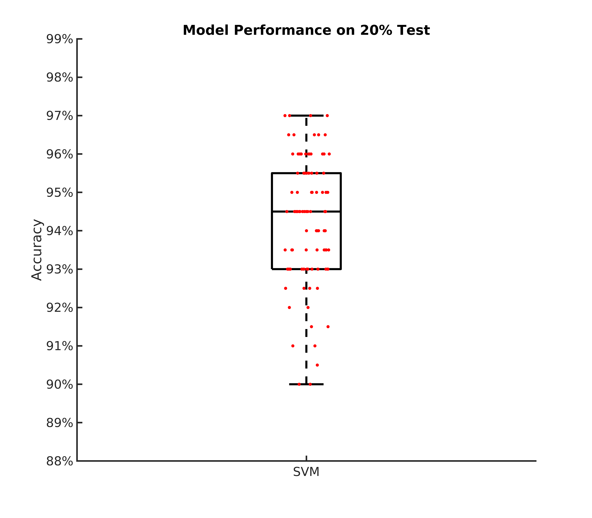

# B-SOID: Behavioral segmentation of open field in DeepLabCut

[DeepLabCut](https://github.com/AlexEMG/DeepLabCut)<sup>1,2</sup> has revolutionized the way behavioral scientists analyze data. The algorithm utilizes recent advances in computer vision and deep learning to automatically estimate 3D-poses. Interpreting the positions of an animal can be useful in studying behavior; however, it does not encompass the whole dynamic range of naturalistic behaviors. 

Behavioral segmentation of open field in DeepLabCut, or B-SOID ("B-side"), is an unsupervised learning algorithm written in MATLAB that serves to discover behaviors that are not pre-defined by users. Our algorithm can segregate statistically different sub-second rodent behaviors with a single bottom-up perspective video-camera. Upon DeepLabCut extraction of the 6 body parts positions (snout, the 4 paws, and the base of the tial) outlining a rodent navigating an open environment, this algorithm performs t-Distributed Stochastic Neighbor Embedding (t-SNE<sup>4</sup>, MATLAB&copy;) of the 7 different time-varying signals to fit Gaussian Mixture Models<sup>5</sup>. The output agnostically separates statistically significant distributions in the 3-dimensional action space and are found to be correlated with different observable rodent behaviors.

This usage of this algorithm has been outlined below, and is extremely flexible in adapting to what the user wants. With the ever-blooming advances in ways to study an animal behavior, our algorithm builds on what has already been robustly tested, and integrates them to help advance scientific research, not to mention the flexibility behind this idea in aritificial intelligence.


## Installation

Use Git using the web URL or download ZIP. 

Change your current working directory to the location where you want the cloned directory to be made.

```bash
git clone https://github.com/YttriLab/B-SOID.git
```

## Usage
Change MATLAB current folder to `B-SOID/bsoid` 

### Step I 
Import .csv file, and convert it to a matrix.
Using the demo mouse navigating the open-field from the Yttri-Lab
```matlab
data_struct = import(Ms2OpenField.csv);
rawdata = data_struct.data
```
### Step II
Apply a low-pass filter for data likelihood. `dlc_preprocess` finds the most recent x,y that are above the threshold and replaces with them. Refer to [dlc_preprocess.md](docs/dlc_preprocess.md).
Based on our pixel-error, the Yttri lab decided to go with 0.1 as the likelihood threshold.
```matlab
data = dlc_preprocess(rawdata,0.1);
```
### Step III
#### &nbsp;&nbsp;&nbsp;&nbsp; `Option 1`: Manual criteria for a rough but fast analyses (If you are interested in considering the rough estimate of the 7 behaviors: 1 = Pause, 2 = Rear, 3 = Groom, 4 = Sniff, 5 = Locomote, 6 = Orient Left, 7 = Orient Right). Refer to [bsoid_mt.md](docs/bsoid_mt.md)
Based on our zoom from the 15 inch x 12 inch open field set-up, at a camera resolution of 1280p x 720p, the Yttri lab has set criteria for the 7 states of action. This fast algorithm was able to automatically detect the gross behavioral changes in Parkisonian mouse from the Yttri lab. This can serve as a quick first pass at analyzing biases in transition matrices, as well as overarching behavioral changes before digging further into the behavior (`Option2`).
```matlab
[g_label,g_num,perc_unk] = bsoid_mt(data,pix_cm); % data, pixel/cm
```
#### &nbsp;&nbsp;&nbsp;&nbsp; `Option 2`: Unsupervised grouping of the purely data-driven action space. Refer to [bsoid_gmm.md](docs/bsoid_gmm.md)
Based on the comparable results benchmarked against human observers for the Yttri lab dataset, we also tested the generalizability with a dataset from the Ahmari lab and found that the agnostic data-driven approach allowed for scaling to the zoom as well as animal-animal variability. It will also sub-divide what seems to be the same action groups into different categories, of which may or may not be important depending on the study.

```matlab
[feats,f_10fps,tsne_feats,grp,llh,bsoid_fig] = bsoid_gmm(data,60,1); % data, frame rate, 1 classifier for all.
```

## The following steps are only valid if you go with `Option 2`
### Step IV 
#### Build your own Support Vector Machine classifier based on feature distribution of the individual GMM groups! Refer to [bsoid_mdl.md](docs/bsoid_mdl.md)

```matlab
[OF_mdl,CV_amean,CV_asem,acc_fig] = bsoid_mdl(f_10fps,grp); % features and GMM groups from bsoid_gmm
```
This example below shows model performance on 20% of the data that was held out from training. Each dot represents 200 randomly sampled actions, and there are 100 total run-throughs, without replacement, for showing the robust accuracy.


### Step V
#### With the model built, we can accurately and quickly predict future mouse datasets by just looking at their feature. This is essentially `Option 1` with a *computer brain* looking at all the data you have fed it. Refer to [bsoid_svm.md](docs/bsoid_svm.md)

```matlab
data_test_struct = import(new_mouse.csv);
rawdata_test = data_test_struct.data
[labels,f_10fps_test] = bsoid_svm(rawdata_test,OF_mdl); % features and GMM groups from bsoid_gmm
```


### *(OPTIONAL) Step VI (If you are interested in creating short videos (.avi) of the groups). This is not recommended if it has more than 100,000 frames at 720*1280p.*
#### Read the video and create a handle for it.
```matlab
vidObj = VideoReader(filenamevid); % video used to generate DLC
```
#### Assuming all behaviors can be sampled from the first 10 minutes (600 seconds), have MATLAB store only every 10 frames per second.
```matlab
k = 1; kk = 1;
while vidObj.CurrentTime < 599.9
    vidObj.CurrentTime = k/60;
    video{i}(kk).cdata = readFrame(vidObj); % save only every 10fps
    kk = kk+1; % save only every 10fps
    k = k+round(vidObj.FrameRate)/10; % reduce down to 10fps (100ms/frm)
end
```
#### Create short videos in the desired output folder (default = current directory) of different groups of action clusters that at least lasted for ~300ms, and slow the video down to 0.75X for better understanding.
```matlab
filepathout = uigetdir;
[t,b,b_ex] = action_gif(video,grp_fill,1,5,6,0.75,filepathout);
```


## Contributing

Pull requests are welcome. For recommended changes that you would like to see, open an issue.

We are a neuroscience lab and can easily foresee this as being upgraded. Please do not hesitate in helping us working towards a more efficient and accurate algorithm. All major contributors will be cited in our publications.

## License

This software package provided without warranty of any kind and is licensed under the GNU Lesser General Public License v3.0. 
Cite us if you use the code and/or data!.https://choosealicense.com/licenses/mit/)

## References
1. [Mathis A, Mamidanna P, Cury KM, Abe T, Murthy VN, Mathis MW, Bethge M. DeepLabCut: markerless pose estimation of user-defined body parts with deep learning. Nat Neurosci. 2018 Sep;21(9):1281-1289. doi: 10.1038/s41593-018-0209-y. Epub 2018 Aug 20. PubMed PMID: 30127430.](https://www.nature.com/articles/s41593-018-0209-y)

2. [Nath T, Mathis A, Chen AC, Patel A, Bethge M, Mathis MW. Using DeepLabCut for 3D markerless pose estimation across species and behaviors. Nat Protoc. 2019 Jul;14(7):2152-2176. doi: 10.1038/s41596-019-0176-0. Epub 2019 Jun 21. PubMed PMID: 31227823.](https://doi.org/10.1038/s41596-019-0176-0)

3. [Insafutdinov E., Pishchulin L., Andres B., Andriluka M., Schiele B. (2016) DeeperCut: A Deeper, Stronger, and Faster Multi-person Pose Estimation Model. In: Leibe B., Matas J., Sebe N., Welling M. (eds) Computer Vision – ECCV 2016. ECCV 2016. Lecture Notes in Computer Science, vol 9910. Springer, Cham](http://arxiv.org/abs/1605.03170)

4. [L.J.P. van der Maaten. Accelerating t-SNE using Tree-Based Algorithms. Journal of Machine Learning Research 15(Oct):3221-3245, 2014.](https://lvdmaaten.github.io/publications/papers/JMLR_2014.pdf)

5. [Chen M. EM Algorithm for Gaussian Mixture Model (EM GMM). MATLAB Central File Exchange. Retrieved July 15, 2019.](https://www.mathworks.com/matlabcentral/fileexchange/26184-em-algorithm-for-gaussian-mixture-model-em-gmm)
