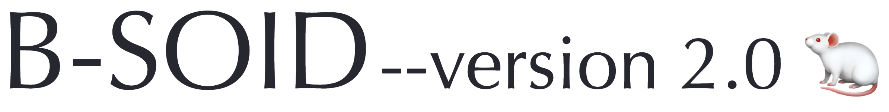

### Why B-SOiD ("B-side")?
[DeepLabCut](https://github.com/AlexEMG/DeepLabCut) <sup>1,2,3</sup>, 
[SLEAP](https://github.com/murthylab/sleap) <sup>4</sup>, and 
[OpenPose](https://github.com/CMU-Perceptual-Computing-Lab/openpose) <sup>5</sup> 
have revolutionized the way behavioral scientists analyze data. 
These algorithm utilizes recent advances in computer vision and deep learning to automatically estimate 3D-poses. 
Interpreting the positions of an animal can be useful in studying behavior; 
however, it does not encompass the whole dynamic range of naturalistic behaviors. 

B-SOiD identifies behaviors using a unique pipeline where unsupervised learning meets supervised classification. 
The unsupervised behavioral segmentation relies on non-linear dimensionality reduction <sup>6,7,9,10</sup>, 
whereas the supervised classification is standard scikit-learn <sup>8</sup>.

Behavioral segmentation of open field in DeepLabCut, or B-SOiD ("B-side"), as the name suggested,
 was first designed as a pipeline using pose estimation file from DeepLabCut as input. Now, it has extended to handle 
DeepLabCut (.h5, .csv), SLEAP (.h5), and OpenPose (.json) files.

### Installation

#### Step 1: Install [Anaconda/Python3](https://www.anaconda.com/)

#### Step 2: Clone B-SOID repository with anaconda prompt

Git clone the web URL (example below) or download ZIP. 

Change your current working directory to the location where you want the cloned directory to be made.
```bash
git clone https://github.com/YttriLab/B-SOID.git
```

### Usage
#### Step 1: Setup, open an anaconda/python3 instance and install dependencies with the requirements file
```
cd /path/to/B-SOID/
```

For MacOS users
```
conda env create -n bsoid_v2 -f requirements.yaml (macOS)
```

or for Windows users

```
conda env create -n bsoid_v2 -f requirements_win.yaml (windows) 
```

```
conda activate bsoid_v2
```

You should now see (bsoid_v2) $yourusername@yourmachine ~ %

#### Step 2: Run the app!
```
streamlit run bsoid_app.py
```


#### Archives 
* [matlab](docs/matlab_tutorial.md)
* [python-tsne](docs/python3_tutorial.md)
* [python-umap](docs/bsoid_umap_tutorial.md)
* [bsoid app version 1](docs/bsoid_app_init.md)

### Contributing

Pull requests are welcome. For recommended changes that you would like to see, open an issue. 
Join our [slack group](https://join.slack.com/t/b-soid/shared_invite/zt-dksalgqu-Eix8ZVYYFVVFULUhMJfvlw) 
for more instantaneous feedback.

There are many exciting avenues to explore based on this work. 
Please do not hesitate to contact us for collaborations.

### License

This software package provided without warranty of any kind and is licensed under the [GNU General Public License v3.0](https://choosealicense.com/licenses/gpl-3.0/). 
If you use our algorithm and/or model/data, please cite us! Preprint/peer-review will be announced in the following section. 

### News
September 2019: First B-SOiD preprint on [bioRxiv](https://www.biorxiv.org/content/10.1101/770271v1) 

March 2020: Updated version of our preprint on [bioRxiv](https://www.biorxiv.org/content/10.1101/770271v2)

#### References
1. [Mathis A, Mamidanna P, Cury KM, Abe T, Murthy VN, Mathis MW, Bethge M. DeepLabCut: markerless pose estimation of user-defined body parts with deep learning. Nat Neurosci. 2018 Sep;21(9):1281-1289. doi: 10.1038/s41593-018-0209-y. Epub 2018 Aug 20. PubMed PMID: 30127430.](https://www.nature.com/articles/s41593-018-0209-y)

2. [Nath T, Mathis A, Chen AC, Patel A, Bethge M, Mathis MW. Using DeepLabCut for 3D markerless pose estimation across species and behaviors. Nat Protoc. 2019 Jul;14(7):2152-2176. doi: 10.1038/s41596-019-0176-0. Epub 2019 Jun 21. PubMed PMID: 31227823.](https://doi.org/10.1038/s41596-019-0176-0)

3. [Insafutdinov E., Pishchulin L., Andres B., Andriluka M., Schiele B. (2016) DeeperCut: A Deeper, Stronger, and Faster Multi-person Pose Estimation Model. In: Leibe B., Matas J., Sebe N., Welling M. (eds) Computer Vision – ECCV 2016. ECCV 2016. Lecture Notes in Computer Science, vol 9910. Springer, Cham](http://arxiv.org/abs/1605.03170)

4. [Pereira, Talmo D., Nathaniel Tabris, Junyu Li, Shruthi Ravindranath, Eleni S. Papadoyannis, Z. Yan Wang, David M. Turner, et al. 2020. “SLEAP: Multi-Animal Pose Tracking.” bioRxiv.](https://doi.org/10.1101/2020.08.31.276246)

5. [Cao Z, Hidalgo Martinez G, Simon T, Wei SE, Sheikh YA. OpenPose: Realtime Multi-Person 2D Pose Estimation using Part Affinity Fields. IEEE Trans Pattern Anal Mach Intell. 2019 Jul 17. Epub ahead of print. PMID: 31331883.](https://doi.org/10.1109/TPAMI.2019.2929257). 

6. [McInnes, L., Healy, J., & Melville, J. (2018). UMAP: Uniform Manifold Approximation and Projection for Dimension Reduction.](http://arxiv.org/abs/1802.03426)

7. [McInnes, L., Healy, J., & Astels, S. (2017). hdbscan: Hierarchical density based clustering. The Journal of Open Source Software, 2(11), 205.](https://doi.org/10.21105/joss.00205)

8. [Scikit-learn: Machine Learning in Python, Pedregosa et al., JMLR 12, pp. 2825-2830, 2011.](http://www.jmlr.org/papers/volume12/pedregosa11a/pedregosa11a.pdf)

9. [L.J.P. van der Maaten. Accelerating t-SNE using Tree-Based Algorithms. Journal of Machine Learning Research 15(Oct):3221-3245, 2014.](https://lvdmaaten.github.io/publications/papers/JMLR_2014.pdf)

10. [Chen M. EM Algorithm for Gaussian Mixture Model (EM GMM). MATLAB Central File Exchange. Retrieved July 15, 2019.](https://www.mathworks.com/matlabcentral/fileexchange/26184-em-algorithm-for-gaussian-mixture-model-em-gmm)


