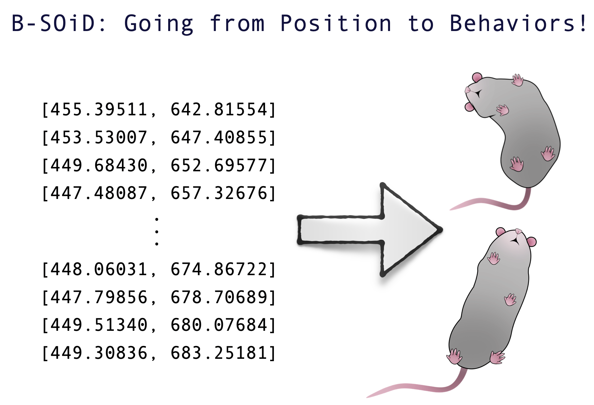

The dataset from *Yttri lab, Alexander Hsu,* has been tested against multiple human observers and showed comparable inter-grader variability as another observer. 


We also tested the generalizability with the dataset from *Ahmari lab , Jared Kopelman, Shirley Jiang, & Sean Piantadosi*, and was predictive of actual behavior.


## Why B-SOiD ("B-side")?
[DeepLabCut](https://github.com/AlexEMG/DeepLabCut)<sup>1,2,3</sup> has revolutionized the way behavioral scientists analyze data. The algorithm utilizes recent advances in computer vision and deep learning to automatically estimate 3D-poses. Interpreting the positions of an animal can be useful in studying behavior; however, it does not encompass the whole dynamic range of naturalistic behaviors. 

Behavioral segmentation of open field in DeepLabCut, or B-SOID ("B-side"), is an unsupervised learning algorithm in MATLAB/Python that serves to discover behaviors that are not pre-defined by users. Our algorithm can segregate statistically different sub-second rodent behaviors with a single bottom-up perspective video-camera. Upon DeepLabCut estimating the positions of 6 body parts (snout, the 4 paws, and the base of the tial) outlining a rodent navigating an open environment, this algorithm performs t-Distributed Stochastic Neighbor Embedding (t-SNE<sup>4</sup>, MATLAB&copy;) of the 7 different time-varying signals to fit Gaussian Mixture Models<sup>5</sup>. The output agnostically separates statistically significant distributions in the 3-dimensional action space and are found to be correlated with different observable rodent behaviors.

This usage of this algorithm has been outlined below, and is extremely flexible in adapting to what the user wants. With the ever-blooming advances in ways to study an animal behavior, our algorithm builds on and integrates what has already been robustly tested to help advance scientific research.

## Installation

Git clone the web URL or download ZIP. 

Change your current working directory to the location where you want the cloned directory to be made.

```bash
git clone https://github.com/YttriLab/B-SOID.git
```

## Usage
### MATLAB
Follow these [steps](docs/matlab_tutorial.md)

## Python3
Follow these [steps](docs/python3_tutorial.md)

## Contributing

Pull requests are welcome. For recommended changes that you would like to see, open an issue. Or join our [slack group](https://join.slack.com/t/b-soid/shared_invite/zt-dksalgqu-Eix8ZVYYFVVFULUhMJfvlw)

We are a neuroscience lab and welcome all contributions to improve this algorithm. Please do not hesitate to contact us for any question/suggestion.

## License

This software package provided without warranty of any kind and is licensed under the [GNU General Public License v3.0](https://choosealicense.com/licenses/gpl-3.0/). 
If you use our algorithm and/or model/data, please cite us! Preprint/peer-review will be announced in the following section. 

## News
September 2019: First B-SOiD preprint in [bioRxiv](https://www.biorxiv.org/content/10.1101/770271v1) 

## References
1. [Mathis A, Mamidanna P, Cury KM, Abe T, Murthy VN, Mathis MW, Bethge M. DeepLabCut: markerless pose estimation of user-defined body parts with deep learning. Nat Neurosci. 2018 Sep;21(9):1281-1289. doi: 10.1038/s41593-018-0209-y. Epub 2018 Aug 20. PubMed PMID: 30127430.](https://www.nature.com/articles/s41593-018-0209-y)

2. [Nath T, Mathis A, Chen AC, Patel A, Bethge M, Mathis MW. Using DeepLabCut for 3D markerless pose estimation across species and behaviors. Nat Protoc. 2019 Jul;14(7):2152-2176. doi: 10.1038/s41596-019-0176-0. Epub 2019 Jun 21. PubMed PMID: 31227823.](https://doi.org/10.1038/s41596-019-0176-0)

3. [Insafutdinov E., Pishchulin L., Andres B., Andriluka M., Schiele B. (2016) DeeperCut: A Deeper, Stronger, and Faster Multi-person Pose Estimation Model. In: Leibe B., Matas J., Sebe N., Welling M. (eds) Computer Vision – ECCV 2016. ECCV 2016. Lecture Notes in Computer Science, vol 9910. Springer, Cham](http://arxiv.org/abs/1605.03170)

4. [L.J.P. van der Maaten. Accelerating t-SNE using Tree-Based Algorithms. Journal of Machine Learning Research 15(Oct):3221-3245, 2014.](https://lvdmaaten.github.io/publications/papers/JMLR_2014.pdf)

5. [Chen M. EM Algorithm for Gaussian Mixture Model (EM GMM). MATLAB Central File Exchange. Retrieved July 15, 2019.](https://www.mathworks.com/matlabcentral/fileexchange/26184-em-algorithm-for-gaussian-mixture-model-em-gmm)

6. [Scikit-learn: Machine Learning in Python, Pedregosa et al., JMLR 12, pp. 2825-2830, 2011.](http://www.jmlr.org/papers/volume12/pedregosa11a/pedregosa11a.pdf)

7. [Belkina, A.C., Ciccolella, C.O., Anno, R. et al. Automated optimized parameters for T-distributed stochastic neighbor embedding improve visualization and analysis of large datasets. Nat Commun 10, 5415 (2019).](https://doi.org/10.1038/s41467-019-13055-y)
